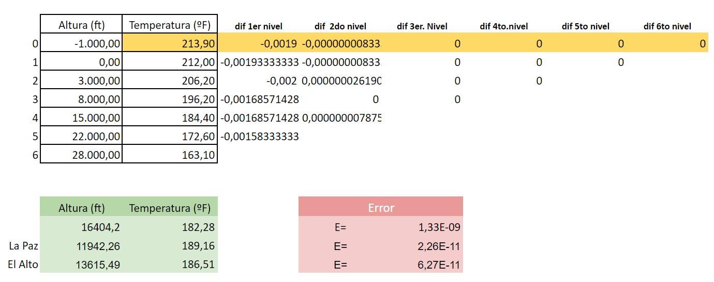

# Grados de ebullición del agua a una altura $x$ sobre el nivel del mar.

Para esto se determinara una ecuación lineal que se ajuste mejor a los siguientes datos:

|Altura($ft$)|Temperatura($ºF$)|
|:-:|:-:|
|-1000|213.9|
|0|212|
|3000|206.2|
|8000|196.2|
|15000|184.4|
|22000|172.6|
|28000|163.1|

Mediante polinomios de interpolación se hallara un polinomio $P(x)$
que se aproxime mejor a la función $f(x)$ (función desconocida),
para hallar un valor aproximado de los grados de ebullición del agua en las
siguientes alturas:

* 16404.2ft
* 11942.26ft (Altura de la ciudad de La Paz - Bolivia)
* 13615.49ft (Altura de la ciudad de El Alto - Bolivia)


## Polinomio de Interpolación de Lagrange
Este polinomio esta determinado por:

$$P(x) = f(x_0)L{n,0}(x) + \cdots + f(x_n)L_{n,n}(x)$$

donde, para cada $k=0, 1, ..., n$

$$L{n,k}(x)=\frac{(x-x_0)(x-x_1)\cdots(x-x_{k-1})(x-x_{k+1})\cdots(x_k-x_n)}{(x_k-x_0)(x_k-x_1)\cdots(x_k-x_{k-1})(x_k-x_{k+1})\cdots(x_k-x_n)}$$
 ### Solución implementada en python
 ```{python}
import sys

def interpLagrange(X, Y, xk):
    res = 0
    n = len(X)
    L = [1]*(n)
    for i in range(n):
        for j in range(n):
            if i != j:
                L[i] *= (xk - X[j])/(X[i] - X[j]) 
        res += Y[i] * L[i]
    return res

X = [-1000, 0, 3000, 8000, 15000, 22000, 28000]
Y = [213.9, 212, 206.2, 196.2, 184.4, 172.6, 163.1]

xk1 = 16404.2
xk2 = 11942.26
xk3 = 13615.49

yk1 = interpLagrange(X, Y, xk1)
yk2 = interpLagrange(X, Y, xk2)
yk3 = interpLagrange(X, Y, xk3)

sys.stdout.write(f'\n==================SOLUCIÓN==================\n')

sys.stdout.write(f'\nPara 5000m:')
sys.stdout.write(f'\nAltura(m) = {str(xk1)} + {error(X, xk1, yk1)}')
sys.stdout.write(f'\nTemperatura(ºF) = {str(yk1)}\n')

sys.stdout.write(f'\nPara la ciudad de La Paz:')
sys.stdout.write(f'\nAltura(m) = {str(xk2)}')
sys.stdout.write(f'\nTemperatura(ºF) = {str(yk1)}\n')

sys.stdout.write(f'\nPara la ciudad de El Alto:')
sys.stdout.write(f'\nAltura(m) = {str(xk2)}')
sys.stdout.write(f'\nTemperatura(ºF) = {str(yk3)}\n')
 ```
Se obtienen los siguientes resultados:
```{python}
==================SOLUCIÓN==================

Para 5000m:
Altura(ft) = 16404.2
Temperatura(ºF) = 182.27643178207313

Para la ciudad de La Paz:
Altura(ft) = 11942.26
Temperatura(ºF) = 189.1581716811097

Para la ciudad de El Alto:
Altura(ft) = 11942.26
Temperatura(ºF) = 186.5054507665994
```
### Resultados
|Ciudad|Altura(ft)|$f(x_i)$|$P(x_i)$|$E_r$|
|:-:|:-:|:-:|:-:|:-:|
||16404.2||182.28||
|La Paz|11942.26|190.4|189.16|0.006512|
|El Alto|13615.49|185|186.51|0.008162|

## Diferencias divididas de Newton

Para cada $k = 0, 1, ..., n$ $P_n(x)$, se puede reescribir en una forma llamada diferencias divididas de Newton:

$$P_n(x)=f[x_0] + \sum_{x = 1}^{n} f[x_0, x_1, ..., x_k](x-x_0)(x-x_1)\cdots(x-x_{k-1})$$

### Solución implementada en excel



### Resultados
|Ciudad|Altura(ft)|$P(x_i)$|$E_r$|
|:-:|:-:|:-:|:-:|
||16404.2|182.28|1,33E-09|
|La Paz|11942.26|189.16|2,26E-11|
|El Alto|13615.49|186.51|6,27E-11|

## Conclusión
Ambas interpolaciones devuelven los mismos resultados, aparentemente ambos se ajustan bien a los datos de la tabla.